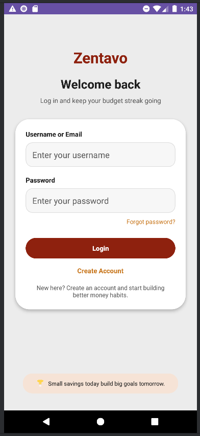
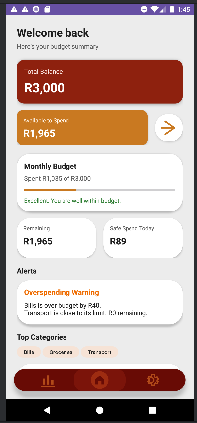
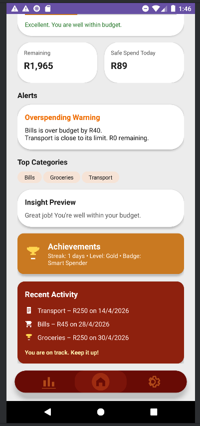
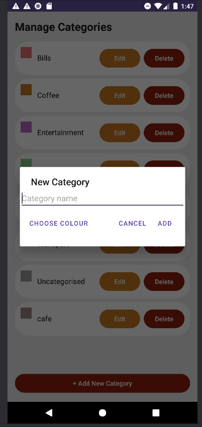
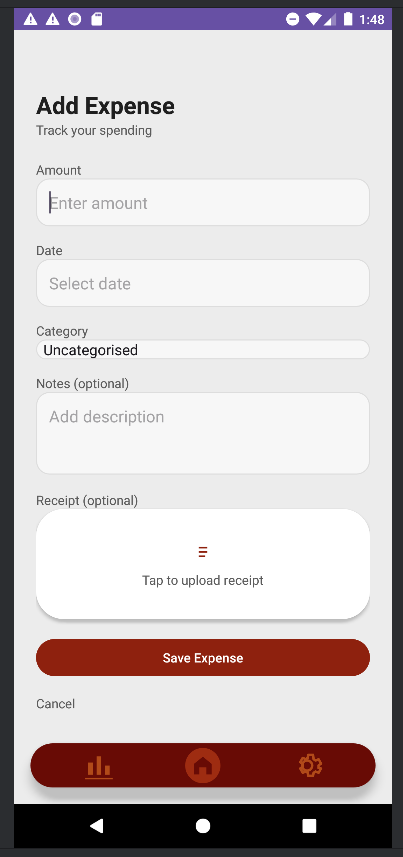
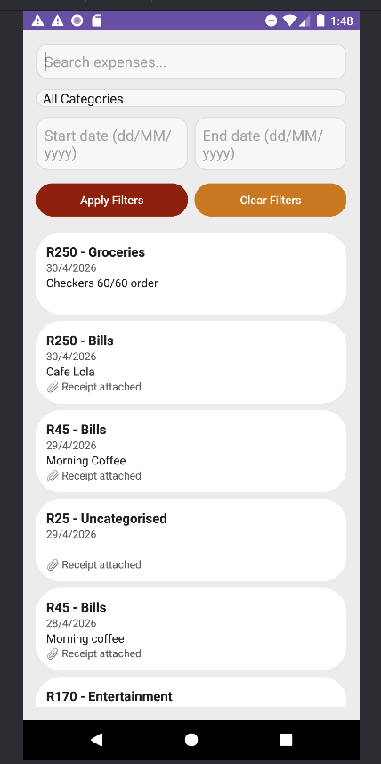
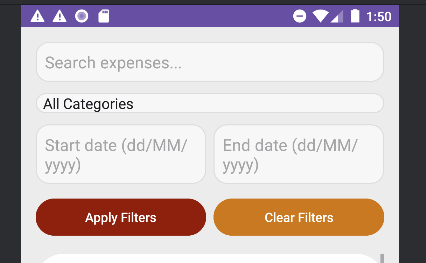
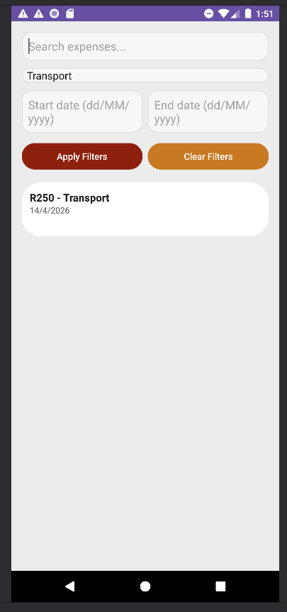
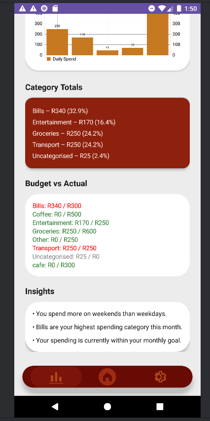

# 💰 PROG7313 POE – Banking App (Zentavo)

## 👥 Group Members

* Neha Singh – ST10433945
* Mofenyi Kubheka – ST10439309
* Oarabile Marwane – ST10436124
* Lesego Raphahla Marota – ST10448763
* Mamaphale Leago Tema – ST10443515

---

# 📌 Zentavo Budget Tracker

## 🧠 Overview

Zentavo is a mobile budgeting application designed to help users manage their personal finances through structured expense tracking, category organisation, and monthly budgeting.

The application provides users with clear visibility of their financial activity and promotes responsible spending habits.

---

## 🎯 Design Considerations

* User-friendly interface with simple navigation
* Consistent layout, colours, and spacing
* Error handling to prevent crashes
* Clear and readable financial data

---

## ⚙️ Core Features

### 🔐 User Authentication

* Users can register and log in
* Secure access to the application

---

### 📂 Category Management

* Create, edit, and delete categories
* Prevents duplicate categories (case-insensitive)

---

### ➕ Add Expense

Users can create expenses with:

* Amount
* Date
* Description
* Category

✔ Stored in RoomDB
✔ Updates immediately

---

### 🧾 Receipt Upload (Optional)

* Users can attach a receipt indicator to expenses

---

### 📅 Expense History & Filtering

* View all expenses
* Filter by category
* Filter by date range

---

### 📊 Category Totals

* Displays total spending per category
* Shows percentage breakdown

---

### 📉 Monthly Planner

* Set minimum and maximum goals
* Allocate budgets per category
* Track remaining budget

---

### 🏠 Dashboard

Displays:

* Total balance
* Remaining amount
* Daily spend estimate
* Alerts (overspending warnings)
* Top categories
* Recent activity

---

### 🏆 Gamification

* Achievements and streak tracking

---

## 💾 Data Storage

* Uses Room (SQLite database)
* Supports offline usage and persistence

---

## 🧪 Automated Testing & CI/CD

GitHub Actions workflows included:

* Build Debug APK
* Unit Testing
* Dependency Check
* Android Lint
* Final Release Validation

---

## 🖼️ Screenshots

### 🔐 Login Screen

### 🏠 Dashboard

### 📂 Category Management

### ➕ Add Expense

### 📜 Expense History & Filters

### 📊 Category Totals

---

## 📱 APK Download

👉 [Download APK](apk/app-debug.apk)

---

## 🎥 Demonstration Video

---

## 📄 Documentation

Located in:
docs/

Includes:

* Part 1 PDF

---

## ▶️ How to Run the App

1. Clone repository
2. Open in Android Studio
3. Sync Gradle
4. Run on emulator or device
5. Login or register

---

## 📦 Submission Checklist

✔ Source code
✔ README
✔ Screenshots
✔ APK
✔ Demo video
✔ Documentation

---

## 📝 Final Notes

Zentavo is a fully functional budgeting application that meets the requirements of Part 2.

It demonstrates:

* Working Android app
* Room database integration
* Required features from rubric
* Clean UI
* Automated testing via GitHub Actions

The application runs successfully and satisfies all submission requirements.
